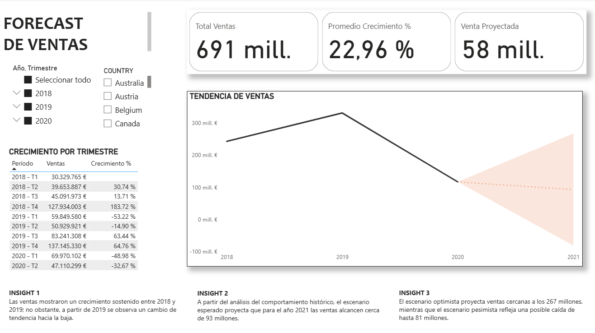

# SALES_FORECAST

## DESCRIPCIÓN

Se realiza Forecast de ventas para una compañía de carros a partir de la tendencia histórica de los años 2018,2019 y 2020, lo que permite estimar el comportamiento futuro de las ventas en un plazo de 12 meses. Lo anterior, con el objetivo de obtener información que permita apoyar decisiones estratégicas relacionadas con la producción y la operación del negocio. 

## KPI

Los KPI's definidos para este forecast son: 
- Total de ventas
- Promedio de crecimiento
- Venta Proyectada

## DASHBOARD
Dashboard desarrollado en Power BI. Visualización interactiva restringida por políticas institucionales. 
El dashboard integra indicadores clave, análisis histórico y escenarios de forecast en una sola vista, facilitando la comprensión del desempeño pasado y la proyección futura del negocio:

## RECOMENDACIONES
El amplio rango entre los escenarios optimista y pesimista evidencia un alto nivel de incertidumbre, por lo que se recomienda utilizar el escenario esperado como base para la planeación comercial y el establecimiento de metas realistas. 

En este contexto, el escenario pesimista puede servir como referencia para definir acciones preventivas, tales como el control de costos, la priorización de productos más rentables y la optimización de las campañas comerciales. Por su parte, el escenario optimista constituye un insumo para diseñar estrategias comerciales flexibles que permitan escalar las operaciones en caso de que dicho escenario se materialice, como el refuerzo de inventarios, la implementación de campañas de marketing focalizadas y la expansión de los canales de venta. 

Todo lo anterior debe estar acompañado de un monitoreo periódico del desempeño real frente al forecast, que permita ajustar oportunamente las proyecciones y las estrategias conforme se disponga de nueva información.

